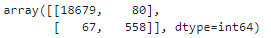
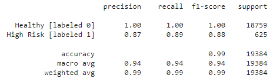

**CREDIT RISK CLASSIFICATION**

**(1) Overview of the Analysis-**

**-Purpose of the analysis:**

Understanding borrower creditworthiness is important for short term and long term business viability of lending institutions. To that end, using available historical lending information to assist with identifying the creditworthiness of borrowers would be hugely advantageous. This exercise and analysis is intended to train and evaluate a model based on loan risk.

**-Data and predictions:**

The dataset used has information on 77,536 unique loans, including details of the size of the loan; the interest rate; the borrower's income; a ration of loan size to income; total debt; loan status; etc. Full details of the dataset can be gained in the .csv file posted in the **Credit Risk** folder as "lending_data.csv".

Predicting whether a loan is high risk or not (whether the loan will be repaid) will be important to the lender.

**-Order of operations:**

Reading in .csv file 

Creating label set (y)

Creating the features (X)

Splitting the dataset into training and testing datasets for y and X

Fitting a logistic regression model by using the training data (X_train and y_train)

Saving the predictions on the testing data labels by using the testing feature data (X_test) and the fitted model

Determine model performance

**-Methods used:**

sklearn train_test_split

sklearn logistic regression and its .fit and .predict functions

confusion matrix

classification report

**(2) Results**
  

(a) The confusion matrix elucidates the performance of the model for which true values are known. The confusion matrix for this exercise is below and is also posted in the **Report** folder-

- True Positive (TP): 558

- True Negative (TN): 18679

- False Positive (FP): 80

- False Negative (FN): 67 

(b) The classification report provides input on how well the model is performing for each class of loan status. The classification report for this exercise is below and is also posted in the **Report** folder-

The two classifications are related to loans, namely Healthy and High Risk. Here are scores from the analysis

(i) **Precision** metrics indicates the percentage of positive predictions (TP) relative to total positive predictions (TP + FP)

- Healthy: **1.0**

- High Risk: **0.87**

(ii) **Recall** metrics indicates the precentatge of correct positive predictions (TP) relative to the total actual positives (TP + FN)

- Healthy: **1.0**

- High Risk: **0.89**

(iii) **f1 Score** metrics are compared to 1.0 to provide insight on how well the model does of predicting

- Healthy: **1.0**

- High Risk: **0.88**

(iv) **Accuracy** metric describes the number of correct instances out of the total number of instances, which is 99%

(v) **Support** metrics denote the number of actual occurrences of a class in the dataset

- Healthy: **18759**

- High Risk: **625**

**(3) Summary**

In trying to develop a methodology to identify the creditworthiness of borrowers, the logistic regression model as designed in this exercise is good as a first pass. Its **Accuracy** was high overall and **Precision**; **Recall**; and **f1 score** were decent at greater than 87% for High Risk loans. Lenders in general may want to have slightly higher **Accuracy**; **Precision**; and **Recall** metrics since their business is predicated upon return of the loan's principal, plus the influx of the resultant interest. Even small numbers of partial loan repayments or full loan defaults can impact the ability to continue lending.

It might be advantageous to improve the modeling. If additional information is available on the loans and their recipients (e.g., successful previous repayment; number of open loans; etc.), these could help with more robust modeling and more definite scores. It might be worth continuing to improve the modeling in parallel with use of the current model (i.e., process improvement) or slightly delay model implementation to provide the best modeling possible at point in the immediate future.

**(4) Citations**

Xpert Learning Assistant - questions about data preparation; confusion matrices; and classification reports

